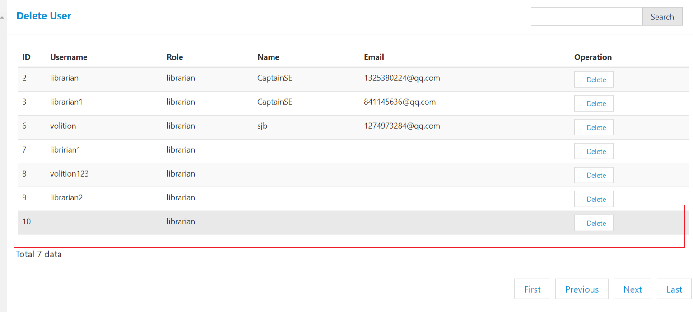
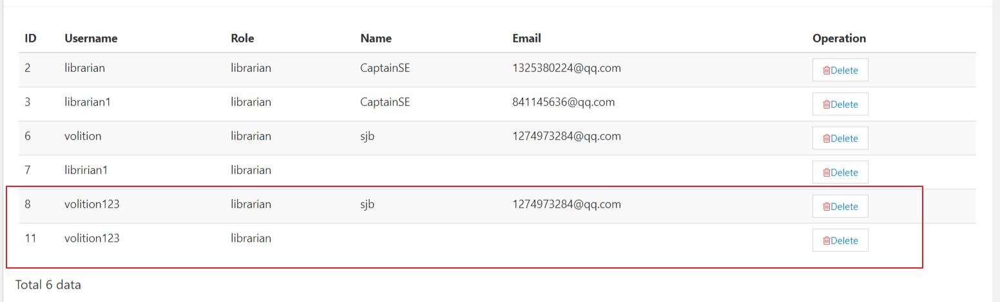

#admin test

1.Login

> 1. 空值测试（通过）
> 2. 用户名或者密码错误：跳转到读者/管理员的登录界面（通过）

2.Logout

>

3.Register new Librarian  default password 00010001

> 1. 用户名重复：添加失败（通过）
>
> 2. 只写管理员的用户名，不填写Name和Email，也可以添加成功，Name和Email的默认值为空（通过）
>
> 3. Username是空值的时候也可以添加成功。（错误）
>
> 4. 输入一个已经存在的UserName，但是不输入Name和Email的时候，也能够添加成功（错误）
>

4.Search Librarian with name and edit/delete Librarian 

> 1. 搜索不存在的图书管理员的时候，也能够找出一个结果（错误）
>
> 2. 搜索存在图书管理员（通过）
>
> 3. 不输入管理员的username,直接搜索的时候也能够找到一个结果(错误)
>
> 4. 删除管理员页面的分页有问题（错误）
>
>    点击Next，之后会跳转到下一页，但是下一页没有数据
>
> 5. 删除管理员页面的搜索功能没有实现（错误）

5.Set/ modify book fine value

> 1. 无法测试
>
> 2. 填写一个负数也可以（错误）
>
> 3. 空值测试（错误）
>

6.Set/ modify book return period

> 1. 填写一个零或负数也可以（错误）
>
> 2. 填写一个正数（通过）
>
> 3. 空值测试（错误）
>

7.Set/ modify reader deposit value

> 1. 填写一个负数也是可以的（错误）
> 2. 填写零或者正数（通过）
> 3. 空值测试（错误）

8.Change admin password

> 1. 正常值测试（通过）
> 2. 空值测试（通过）
> 3. 旧密码与新密码相同（通过）

